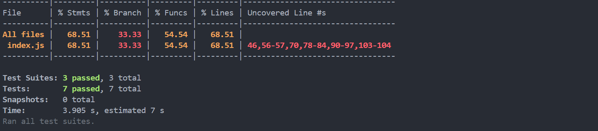

# 📦 Custom API Server with MySQL and Express.js

This project is a basic CRUD web application using **Node.js**, **Express.js**, **MySQL**, and **EJS** for the frontend. It includes full Create, Read, Update, and Delete operations, flash message notifications, Bootstrap styling, and uses environment variables for secure database connection.

---

## 🔧 Features

✅ Add, update, delete, and list users  
✅ EJS frontend styled with Bootstrap  
✅ Flash messages for user feedback  
✅ Password & DB config secured with `.env`  
✅ Clean and modular folder structure  

---

## 📁 Project Structure
api-server/
│
├── index.js # Main server file
├── db.js # MySQL DB config
├── .env # Environment variables (NOT committed)
├── .gitignore # node_modules, .env, coverage excluded
├── views/ # EJS frontend
│ └── index.ejs
├── mocks/ # Mocked db.js for unit testing
├── tests/
│ ├── unit/ # Unit tests
│ ├── integration/ # Integration tests with real DB
│ └── api/ # API endpoint tests with Supertest
├── coverage/ # Auto-generated test coverage report
├── package.json # Dependencies and scripts

---

## 🚀 How to Run Locally

### 1. Clone the repository

```bash
git clone https://github.com/bhavdeep54/api-server.git
cd api-server
```
### 2. Install dependencies
```bash
Copy
Edit
npm install
```
### 3. Set up MySQL database
```sql
Copy
Edit
CREATE DATABASE your_database_name;
USE your_database_name;

CREATE TABLE users (
  id INT AUTO_INCREMENT PRIMARY KEY,
  name VARCHAR(255),
  email VARCHAR(255)
);
```
### 4. Configure .env
Create a .env file in the root:

```env
Copy
Edit
DB_HOST=localhost
DB_USER=root
DB_PASS=your_password
DB_NAME=your_database_name
```
### 5. Start the server
```bash
Copy
Edit
nodemon index.js
# or
node index.js
Visit: http://localhost:3000
```
## ✨ API Endpoints
Method	Endpoint	Description
GET	/	List all users
POST	/users	Add a new user
DELETE	/users/:id	Delete a user
PUT	/users/:id	Update a user

All routes are handled using EJS form submissions.

## 🧪 Testing
This project includes a complete test suite for unit, integration, and API testing using Jest and Supertest.

### 📂 Tests Structure
```bash
Copy
Edit
tests/
├── unit/              # Pure logic & mocked DB (dbUtils)
├── integration/       # Real DB interaction tests
├── api/               # Supertest-based endpoint testing
```
### 📦 Tools & Frameworks Used
```
Jest – for running tests and checking coverage

Supertest – for end-to-end API testing

Mocking – using __mocks__/db.js for isolated unit tests
```
### ✅ Run Tests
```bash
Copy
Edit
npm test
Jest will also generate a test coverage report.
```
### Coverage Screenshot



### 🔐 Environment & Security
```
Secrets are stored securely in a .env file

.env, node_modules, and coverage/ are excluded using .gitignore
```
### Optional Improvements
```
Add search/sort functionality

Form validations (client & server)

Use ORM like Sequelize or Prisma

Deploy on Render, Railway, or Vercel
```
### 📜 License
```
Licensed under the MIT License
```
Let me know if you'd like a downloadable version or `.md` file directly!


